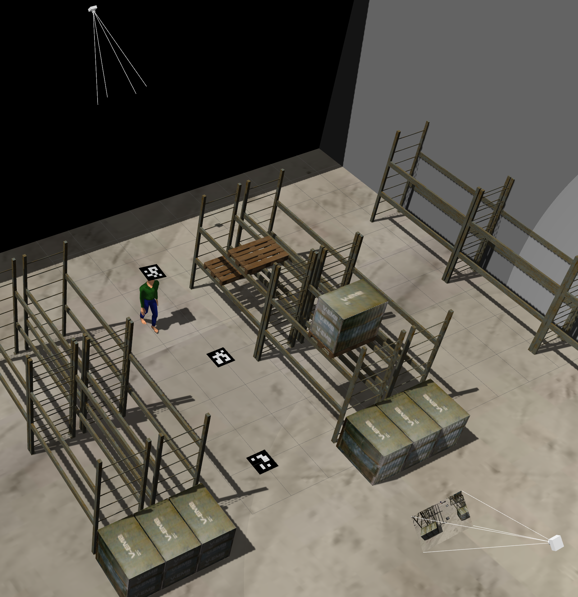

# InfoBot Navigation Within a Simulation Warehouse

This is the repository for research project activities at Infotiv Technology Development.

Find technical and more detailed documentation and specifications in the following links:

- [Simulation](simulation/README.md)
- [Building Gazebo models (Blender/Phobos)](simulation/raw_models/README.md)
- [Objects specifications](simulation/raw_models/objects/README.md)
- [Warehouse specification](simulation/raw_models/warehouse/README.md)
- [Camera extrinsic calibration](processing/extrinsic) and [Camera intrinsic calibration](processing/intrinsic)



[video demo 1](resources/demo1.mp4)
,
[video demo 2](resources/demo2.mp4)


Click on image below to see the Volvo layout demo:

[](https://www.youtube.com/watch?v=f8ULCZFEM5Q)

## Installation in development environment

Dependencies: `vscode` (with `Dev containers` extension) and `docker`.

To improve collaboration in development environment we use vscode and docker as explained in [this instruction](https://www.allisonthackston.com/articles/docker-development.html) using these [docker files](https://github.com/athackst/dockerfiles).

To build the docker files with nvidia support, update `.devcontainer/devcontainer.json`  from `"service": "smile_simulation"` to `"service": "smile_simulation_nvidia"`. To build and open the container in vscode: `Ctrl + Shift + P` and select `Dev containers: Rebuild and Reopen in container` . 


### Quick start commands
Please run these commands in the vscode terminal after vscode is connected to the docker as image below (in working directory `~/src`):


To kill previously running simulation instances, build the project again and start the simulation environment and agents(spawn robots, Aruco marks and cameras on the scene):

```bash
./start.sh sim
```

The jackal can then be controlled with the computer keyboard by running:

```bash
./start.sh teleop_jackal
```
To control the infobot using keyboard:

```bash
./start.sh teleop_infobot
```

To record camera images we use a simple python code [./processing/camera_subscriber.py](./processin/camera_subscriber.py) that can be executed with following command:

```bash
./start.sh cam_record
```
The result will be stored in `./processing/images_data/`. 

## Advanced features (not fully supported yet):


To kill all relevant process (related to gazebo, ros2), delete build files, delete recorded images and rosbag files using the following command:

```bash
./start.sh clean
```

To clean up and build the ros2 simulation

```bash
./start.sh build
```
To test the unit tests before pushing new codes:
```bash
./start.sh clean
```


To record ros messages in ROS bag files to replay the scenario later:

```bash
./start.sh ros_record
```

To replay the last rosbag recording:

```bash
./start.sh ros_replay
```

```
Files:             rosbag2_2024_03_18-07_53_18_0.db3
Bag size:          77.0 KiB
Storage id:        sqlite3
Duration:          30.980s
Start:             Mar 18 2024 07:53:21.942 (1710748401.942)
End:               Mar 18 2024 07:53:52.923 (1710748432.923)
Messages:          554
Topic information: Topic: /cmd_vel | Type: geometry_msgs/msg/Twist | Count: 554 | Serialization Format: cdr

[INFO] [1710775265.896618797] [rosbag2_storage]: Opened database 'rosbag2_2024_03_18-15_16_56/rosbag2_2024_03_18-15_16_56_0.db3' for READ_ONLY.
```

(optionally) To do cartography: 

```bash
./start.sh slam
```

To start nav2 navigation stack and start commanding the infobot to move in the map:

```bash
./start.sh nav
```
and then: 

```bash
./start.sh commander
```

### Additional information

Please see [LICENSE](LINCESE), [CREDITS.md](CREDITS.md) and [CHANGELOG.md](CHANGELOG.md) for more information.